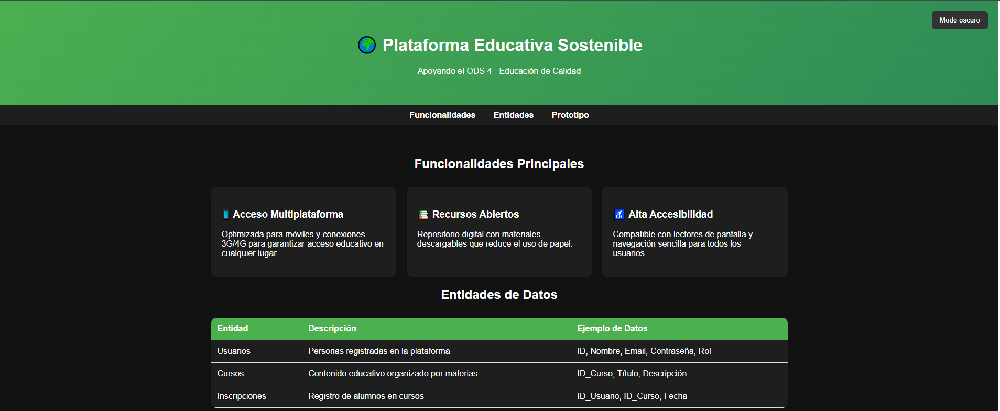

<<<<<<< HEAD

## 1. Analisis del Problema y Enfoque de Sostenibilidad

### El "Bug" Educativo

> En muchos lugares, el acceso a la educación digital sigue siendo limitado debido a
> plataformas pesadas, mala accesibilidad y falta de recursos educativos gratuitos.
> Además, el uso excesivo de papel en materiales educativos genera un impacto
> ambiental negativo. Estas barreras dificultan que estudiantes con conexiones
> lentas o dispositivos antiguos puedan acceder a contenidos educativos de calidad.

### Nuestro "Parche" Sostenibles

- [ ] Medida 1: Uso de un diseño web ligero con imágenes optimizadas para que la plataforma cargue rapido incluso con conexiones lentas.
- [ ] Medida 2: Implementación de accesibilidad para lectores de pantalla y navegación sencilla para todos los usuarios.
- [ ] Medida 3: Uso de modo oscuro para reducir el consumo de energía en dispositivos moviles.
- [ ] # Medida 4: Sustitución de materiales en papel por recursos digitales accesibles desde la web.

## 2. Arquitectura de la Solución Web

### Funcionalidades Principales

1. **Acceso Multiplataforma Ligero:** Optimización de carga para dispositivos con pocos recursos y conexiones 3G/4G.
2. **Repositorio de Recursos Abiertos:** Biblioteca de materiales descargables para reducir el uso de papel y la brecha digital.
3. **Interfaz de Alta Accesibilidad:** Diseño compatible con lectores de pantalla y navegación simplificada para personas con discapacidad.

### Entidades de Datos Básicas

| Entidad           | Descripción                                 | Ejemplo de datos a guardar                                 |
| :---------------- | :------------------------------------------ | :--------------------------------------------------------- |
| **Usuarios**      | Personas registradas en la plataforma       | ID_Usuario, Nombre, Email, Contraseña, Rol (Profe/Alumno). |
| **Cursos**        | Contenido didáctico organizado por materias | ID_Curso, Título, Descripción, Fecha_Creación.             |
| **Inscripciones** | Registro de alumnos apuntados a cada curso  | ID_Usuario, ID_Curso, Fecha_Inscripción.                   |

### Prototipo de Interfaz (Frontend)

A continuación se muestra el wireframe de nuestra aplicación diseñado en Excalidraw/Figma:

**Breve explicación:** El diseño muestra un panel de control minimalista que facilita la navegación rápida hacia los cursos y recursos descargables. Incluye una sección de ajustes de sostenibilidad para activar el modo de bajo consumo de datos y mejorar la accesibilidad universal.

> > > > > > > 9ad1b72400521481dabb38bfda32a0167205eb8e
